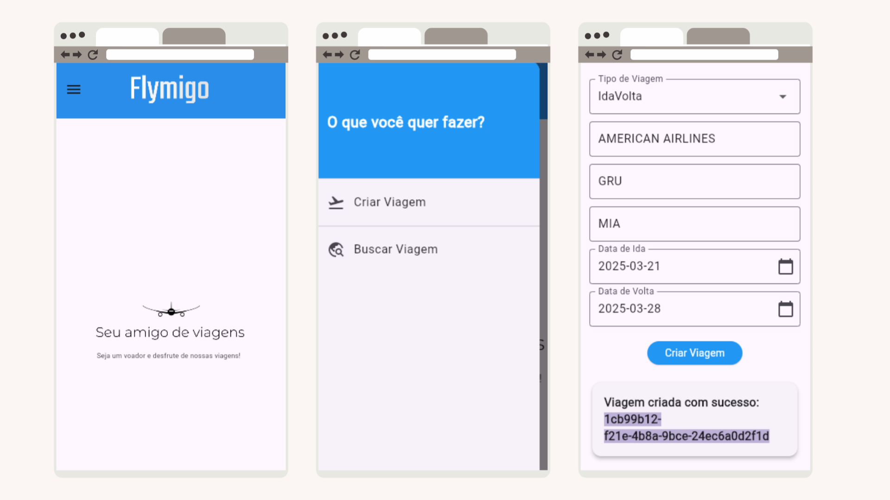
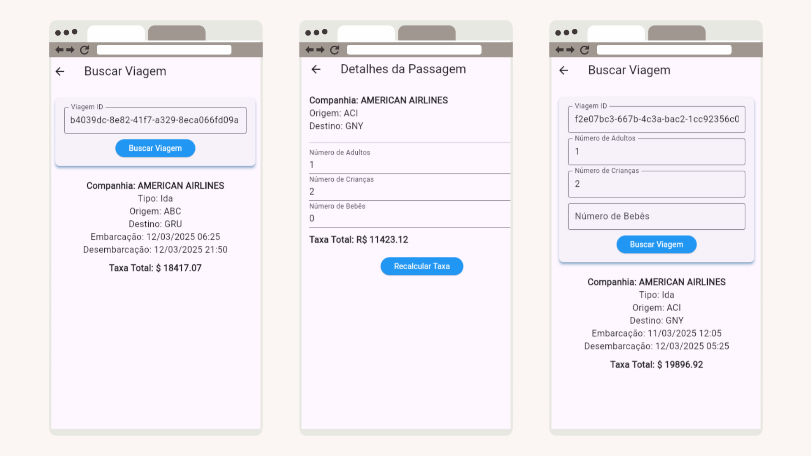

# Flymigo

## Introdução

Flymigo é um aplicativo multiplataforma que permite com que usuários possam simular viagem aéreas e visualizar relatórios detalhados sobre as suas viagens através de um ID gerado ao criar uma viagem.

As simulações e relatórios são criados com base nas chamadas assíncronas de uma API que simula o ambiente de viagens aéreas. O aplicativo permite que os usuários escolham uma origem, destino, data de partida e data de retorno, entre outras seleções.

## Instalação

Para rodar o aplicativo localmente, siga as seguintes instruções:

Primeiro, no seu terminal, execute o seguinte comando para clonar o repositório do projeto: `git clone https://github.com/pedrjose/flymigo-app.git`

Feito isso, vamos instalar o projeto:

1. `flutter pub get`: Instalar dependências necessárias;
1.1. `flutter devices` (Opcional): Caso queira escolher um dispositivo manualmentemente antes de iniciar o aplicativo;
2. `flutter run`: Executar o aplicativo no emulador web ou dispositivo móvel.